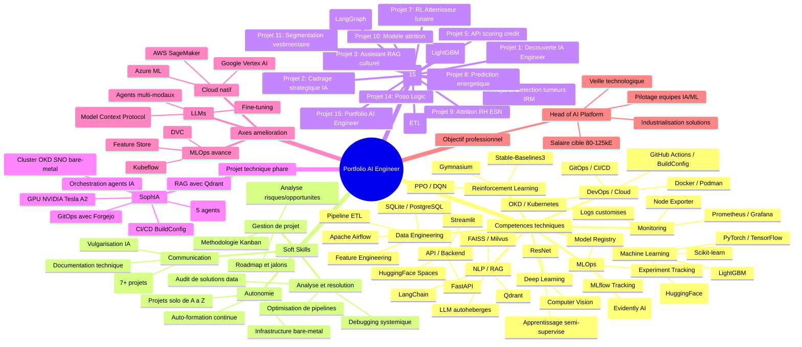

# Carte mentale — Portfolio AI Engineer (Damien)

## mindmap

---

## Analyse reflexive

### Evolution du parcours

La formation AI Engineer a transforme ma vision du metier. J ai commence avec des fondamentaux (cadrage IA, culture IA) pour aboutir a une plateforme d orchestration d agents IA sur infrastructure bare-metal (SophIA). Le chemin parcouru est significatif.

### Ce que la formation m a apporte

- **Vision systemique** : Capacite a concevoir des solutions de bout en bout, de la collecte du besoin au monitoring en production
- **Autonomie technique** : Deploiement d un cluster OKD complet sur bare-metal, gestion GPU, CI/CD, GitOps
- **Rigueur MLOps** : Tracking d experiences, gestion de modeles, monitoring de derive
- **Polyvalence** : ML classique, Deep Learning, RL, NLP, Computer Vision

### Changements dans ma representation du metier

Avant la formation, je voyais l AI Engineer comme un Data Scientist qui deploye. Aujourd hui, je le vois comme un **architecte de plateforme** qui orchestre donnees, modeles, infrastructure et equipes.

### Ce que j aurais fait differemment

- Integrer plus tot les pratiques GitOps et CI/CD dans les premiers projets
- Documenter systematiquement les choix d architecture des le depart
- Standardiser les stacks (pixi/uv) plus tot dans le parcours

### Progres constates

- Passage de notebooks exploratoires a des pipelines industrialises
- Adoption de Docker/OKD pour tous les deploiements
- Mise en place d un monitoring Prometheus/Grafana systematique
- Capacite a auditer et optimiser une solution data existante

---

## Competences maitrisees (autoevaluation)

| Competence | Niveau (1-5) | Preuve |
|-----------|:---:|--------|
| Python | 5 | Tous les projets |
| Machine Learning | 4 | credit-scoring, attrition-esn |
| Deep Learning | 3 | label_image, fashion-trend |
| Reinforcement Learning | 3 | atterrisseur_lunaire |
| NLP / RAG | 4 | culture-ia, chess_master, SophIA |
| MLOps | 4 | MLflow, Evidently, tracking |
| Docker / Conteneurisation | 5 | OKD, SophIA, tous les deploiements |
| Kubernetes / OKD | 4 | Cluster SNO, agents, BuildConfig |
| CI/CD | 4 | GitHub Actions, BuildConfig, GitOps |
| API REST | 4 | FastAPI sur 5+ projets |
| Streamlit / Dashboard | 4 | 4+ dashboards deployes |
| Monitoring | 3 | Prometheus, Grafana, Evidently |
| Gestion de projet | 4 | 15 projets menes, Kanban |
| Communication technique | 4 | 7+ soutenances |
