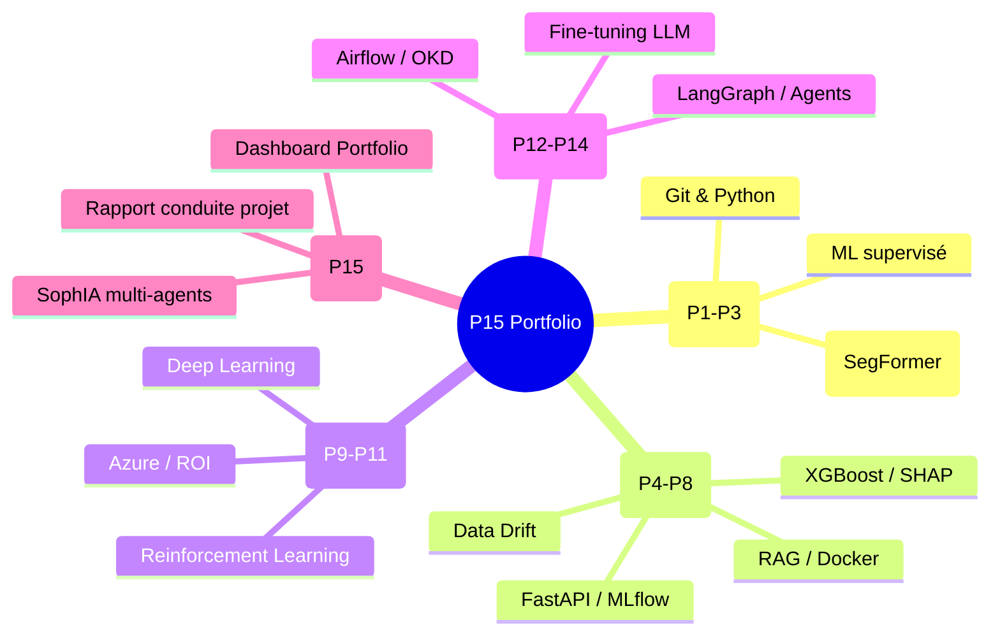

# Rapport de Conduite de Projet

## Portfolio AI Engineer -- Projet 15 (P15)

**Auteur :** Damien GUESDON
**Date :** juin 2026
**Formation :** AI Engineer -- OpenClassrooms (804 h supervisées + 804 h guidées = 1608 heures)
**Projet technique :** SophIA -- Plateforme d'orchestration d'agents IA

---

## 1. Contexte et analyse des besoins

### 1.1 Présentation du projet

Ce rapport est le livrable final du Projet 15 de la formation AI Engineer. Il couvre la démarche de conduite de projet appliquée à la réalisation d'un portfolio professionnel et d'un projet technique personnel.

Le projet technique retenu est **SophIA** (Sovereign Orchestrator Platform for Holistic Intelligence Architecture), une plateforme d'orchestration multi-agents IA déployée sur un cluster OKD SNO bare-metal avec GPU NVIDIA Tesla A2.

L'objectif professionnel vise le poste de **Head of AI Platform**, démontrant la capacité à appréhender l'ensemble des compétences techniques et stratégiques nécessaires — de la conception à l'industrialisation de solutions IA — afin d'encadrer, challenger et guider les équipes d'ingénierie.

Le parcours de l'apprenant s'appuie sur 20 ans d'expertise en infrastructure critique (réseau MPLS, Cisco, BGP, OSPF) et direction technique, renforcés par 1608 heures de formation (804 h supervisées, 804 h guidées) couvrant 15 projets.

### 1.2 Contexte organisationnel

Le projet s'inscrit dans un contexte de transformation profonde du marché de l'IA. Les entreprises découvrent massivement l'IA générative via des outils SaaS (ChatGPT, Copilot) sans gouvernance, créant un phénomène de "Shadow AI" : la propriété intellectuelle (brevets, données financières, secrets industriels) est injectée sur des serveurs étrangers sans contrôle.

Le besoin exprimé n'est pas de "faire de l'IA" mais de le faire en maîtrisant sa souveraineté technologique. Les parties prenantes identifiées sont :

- **Damien Guesdon** en tant qu'AI Engineer et futur Head of AI Platform
- **Les recruteurs** cibles (directions techniques, VP Engineering, directions innovation)
- **Les équipes internes** qui devront maintenir et faire évoluer la plateforme

Les contraintes du projet sont :

- **Autonomie complète** : réalisation en solo de l'infrastructure à l'application
- **Infrastructure bare-metal** : cluster OKD Single Node OpenShift, GPU contraint (16Go, non fractionnable)
- **Budget maîtrisé** : coûts énergétiques et matériel, pas de budget cloud
- **Sécurité** : système air-gappe, isolation réseau par namespace

### 1.3 Parcours de formation : les 14 projets fondateurs

Les 15 projets de la formation constituent une progression pédagogique qui a directement alimenté la conception de SophIA :

| Phase | Projets | Notions acquises |
|---|---|---|
| Fondamentaux (P1-P3) | Découverte AIE, API SegFormer, Regression | Python, Git, consommation API, ML supervisé |
| ML classique (P4-P6) | Classification attrition, FastAPI, Scoring credit | XGBoost, SHAP, FastAPI, MLflow, coût métier |
| MLOps & RAG (P7-P8) | Système RAG, Monitoring dérivés | LangChain, FAISS, Docker, Evidently, Ragas |
| Vision stratégique (P9-P11) | Cadrage Azure, Deep Learning, RL | ROI, RGPD, ResNet, Stable-Baselines3, OpenShift |
| Architecture complexe (P12-P14) | ETL Airflow, Agents LangGraph, Fine-tuning LLM | Airflow, OKD, Milvus, LoRA, vLLM, Presidio |

Les 1608 heures de formation (804 supervisées, 804 guidées) ont permis de construire une vision systémique : un projet comme SophIA ne consiste pas seulement à entraîner un modèle, mais à orchestrer l'ensemble de la chaîne, de la collecte du besoin au monitoring en production. C'est cette approche qui distingue un architecte de plateforme d'un data scientist.

---

## 2. Audit de la solution data existante

### 2.1 Architecture actuelle de SophIA

SophIA est une plateforme multi-agents organisée en 5 piliers interconnectés :

```
                             Utilisateurs / API
                                    |
                                    v
                             WireGuard Access
                                    |
                                    v
+---------------------------------------------------+
| 1. Fondations : Materiel & K8s (OKD SNO)          |
|    - GPU NVIDIA Tesla A2, SCOS immutable          |
|    - 9 namespaces isoles (git, core, inference,   |
|      memory, dmz, skills, apps, sandbox, test)    |
+---------------------------------------------------+
           |                    |
           v                    v
+-------------------+  +---------------------+
| 2. Cerveau        |  | 3. Memoire RAG      |
| Hermes (orchestre)|  | Qdrant + pipeline   |
| LiteLLM (routage) |  | embeddings          |
+-------------------+  +---------------------+
           |                    |
           v                    v
+----------------------------------------------+
| 4. Pantheon Agentique                        |
| SophIA (moteur) | Dionysos (cluster)         |
| Hephaistos (dev) | Ouranos (prod/HITL)       |
| Athena (RBAC/HITL)                           |
+----------------------------------------------+
           |
           v
+-------------------+  +---------------------+
| 5. Automatisation |  | 6. Outils           |
| CI/CD BuildConfig |  | MCP, TTS, Ghost     |
+-------------------+  +---------------------+
```

### 2.2 Stack technique

| Domaine | Technologie |
|---|---|
| Orchestration | OKD (OpenShift) SNO bare-metal |
| Conteneurisation | Docker, Podman, CRI-O |
| Routage LLM | LiteLLM (proxy multimodal) |
| Base vectorielle | Qdrant |
| Monitoring | Prometheus, Grafana, node-exporter |
| Git / CI/CD | Forgejo, BuildConfig, GitOps |
| Sécurité réseau | EgressFirewall, namespaces air-gappes |
| Agents | Hermes (framework agentique) |

### 2.3 Évaluation de la solution existante

**Forces identifiées :**

- Souveraineté totale : aucune donnée ne quitte l'infrastructure
- Agnostisme : les modèles LLM sont interchangeables (Mistral, Llama, Qwen)
- Sécurité : isolation réseau par namespace, pas d'accès sortant pour les zones critiques
- Coût maîtrisé : pas de dépendance à un cloud provider

**Axes d'amélioration :**

- Complexité de maintenance : le cluster bare-metal nécessite une expertise pointue
- GPU contraint : 16Go non fractionnables, limitation pour les gros modèles
- Documentation : l'architecture est documentée mais meriterait un schéma C4 unifié

### 2.4 Les projets précurseurs qui ont nourri SophIA

SophIA n'est pas parti d'une page blanche. Chaque brique de l'architecture a été expérimentée dans les projets précédents :

| Brique SophIA | Projet précurseur | Notion clé |
|---|---|---|
| RAG / Qdrant | P7 (Système RAG Puls-Events) | LangChain, FAISS, embeddings Mistral, Ragas |
| Data Drift / Monitoring | P8 (MLOps avancé) | Evidently AI, NannyML, profiling |
| Orchestration agentique | P13 (Chess Master FFE) | LangGraph, Milvus, MCP |
| Déploiement LLM local | P14 (Triage medical CHSA) | vLLM, Qwen3, LoRA, Presidio |
| Déploiement OKD | P12 (CheckIt.AI) | Airflow, Streamlit sur OKD |
| Tracking d'expériences | P6 (Scoring credit) | MLflow, Optuna, coût métier |

Cette progression montre que SophIA est l'aboutissement d'une montée en compétence progressive : chaque projet a apporté une brique qui trouve sa place dans l'architecture finale.

---

## 3. Identification de la solution technique cible

### 3.1 Architecture cible

L'architecture visée est une plateforme d'orchestration d'agents IA répondant aux exigences de souveraineté, de sécurité et de coût.

Les 9 namespaces OKD sont organisés en zones fonctionnelles :

- **Zone usine (sophia-git)** : Forgejo, CI/CD, seule zone avec accès sortant (GitHub, Gmail)
- **Zone cerveau (sophia-core)** : Hermes, LiteLLM, orchestration centrale
- **Zone air-gappee (sophia-inference, sophia-memory)** : Inférence LLM, Qdrant, aucun accès sortant
- **Zone SAS (sophia-dmz)** : Point d'entrée utilisateur, authentification
- **Zone outils (sophia-skills)** : Outils MCP, TTS, services auxiliaires
- **Zone frontend (sophia-apps)** : Interfaces utilisateur
- **Zone dev (sophia-sandbox)** : Pods de développement et tests
- **Zone CI/CD (sophia-test)** : Tests automatisés

### 3.2 Justification des choix architecturaux

**OKD SNO vs Docker Compose**

Le choix d'OKD (plutôt que Docker Compose utilisé en P7, P8, P13) est motivé par le besoin d'isolation et de sécurité. Docker Compose convient pour un développement local ou un petit déploiement, mais ne permet pas le niveau de cloisonnement requis pour une infrastructure critique. OKD apporte :

- L'isolation réseau par namespace (EgressFirewall)
- La gestion des secrets via RBAC
- La haute disponibilité (même en SNO, les pods sont résilients)
- L'industrialisation via BuildConfig et GitOps

**GPU local vs Cloud**

L'utilisation du GPU NVIDIA Tesla A2 en local (plutôt qu'Azure en P9 ou AWS) est un choix de souveraineté. Les coûts d'inférence sont prévisibles et ne dépendent pas d'un tarif cloud qui peut varier. La contrainte est la limite des 16Go, compensée par l'optimisation des modèles (quantization, vLLM).

**RAG vs Fine-tuning**

Les deux approches ont été expérimentées : le RAG en P7 (LangChain, FAISS) et le fine-tuning en P14 (LoRA, DPO). Le choix pour SophIA est le RAG, car il permet de modifier la base de connaissances sans réentraîner le modèle. Le fine-tuning reste une option pour des tâches spécialisées, via le routage LiteLLM.

**Multi-agents vs monolithe**

L'architecture multi-agents (validée en P13 avec LangGraph) est préférée au monolithe car elle permet de spécialiser chaque agent et de limiter l'impact d'une panne. Chaque agent (Dionysos pour le cluster, Hephaistos pour le dev, etc.) est indépendant et interchangeable.

### 3.3 Hiérarchisation des cas d'usage

| Cas d'usage | Valeur | Effort | Priorité |
|---|---|---|---|
| Routage LLM (LiteLLM) | Élevé | Faible | MVP |
| Chat / assistant conversationnel | Élevé | Moyen | MVP |
| RAG sur documents internes | Élevé | Moyen | V2 |
| Agent supervision cluster (Dionysos) | Moyen | Élevé | V3 |
| Déploiement automatisé (Hephaistos) | Moyen | Élevé | V3 |
| Automatisation n8n | Faible | Moyen | V4 |

---

## 4. Stratégie de mise en oeuvre et d'industrialisation

### 4.1 Roadmap

**Phase MVP (Réalisée)**

- Cluster OKD SNO bare-metal opérationnel
- LiteLLM routeur avec modèles locaux (Mistral, Qwen)
- Hermes orchestrateur d'agents
- 5 agents du Pantheon fonctionnels
- Authentification WireGuard

**Phase V2 (En cours)**

- RAG avec Qdrant et pipeline d'ingestion
- Dashboard portfolio (projets-perso/Dashboard)
- Site vitrine SophIA (sophia.kisai.fr)
- Rapport de conduite de projet

**Phase V3 (Planifiée)**

- Agent Dionysos pour la supervision automatisée du cluster
- Agent Hephaistos pour la création de pods de dev
- CI/CD industrialisé avec BuildConfig
- Tests automatisés dans sophia-test

**Phase V4 (Vision)**

- Automatisation n8n pour les workflows métier
- Outils MCP pour l'intégration IDE
- Agent Athena pour la gestion RBAC
- Agent Ouranos pour le déploiement HITL en production

### 4.2 Industrialisation

**CI/CD et GitOps**

La chaîne CI/CD s'appuie sur Forgejo (instance Git auto-hébergée dans le cluster) et les BuildConfig OKD. Chaque agent est défini par un Dockerfile et déployé via GitOps. Cette approche a été validée en P5 (GitHub Actions vers HF Spaces) et P10 (Tekton/ArgoCD).

**Tests et qualité**

Trois niveaux de tests sont prévus :

1. Tests unitaires (pytest) pour les fonctions métier (validé en P5)
2. Tests API (FastAPI TestClient) pour les endpoints (validé en P5, P13)
3. Tests d'intégration dans le namespace sophia-sandbox

### 4.3 Risques et opportunités

**Risques identifiés :**

| Risque | Probabilité | Impact | Mitigation |
|---|---|---|---|
| Panne GPU | Faible | Critique | Monitoring Prometheus, alerting |
| Coupure électrique | Moyenne | Élevé | Alimentation stabilisée, sauvegardes |
| Obsolescence modèle | Élevé | Moyen | Agnostisme LiteLLM, mise à jour régulière |
| Sécurité (brèche) | Faible | Critique | EgressFirewall, RBAC, audits réguliers |

**Opportunités :**

- Indépendance technologique totale
- Coût d'inférence maîtrisé (pas de taxe cloud)
- Capitalisation sur les 15 projets de formation
- Positionnement unique sur le marché (AI Platform souveraine)

### 4.4 Estimation budgétaire

| Poste | Coût estimé |
|---|---|
| GPU NVIDIA Tesla A2 (acquisition) | ~2000EUR |
| Serveur bare-metal | ~1500EUR |
| Alimentation, refroidissement | ~50EUR/mois |
| Stockage SSD | ~200EUR |
| Abonnements (domaine, email) | ~50EUR/an |
| Coût cloud équivalent (API GPT-4, 1M tokens/jour) | ~300EUR/mois |

L'investissement initial est amorti en moins d'un an par rapport à une solution cloud équivalente. Le coût marginal de l'inférence est proche de zero une fois l'infrastructure en place.

### 4.5 KPIs

| KPI | Cible | Mesure |
|---|---|---|
| Disponibilité du cluster | 99.5% | Uptime Prometheus |
| Temps de réponse inférence | < 5s | Latence LiteLLM |
| Taux d'utilisation GPU | 60-80% | Grafana / nvidia-smi |
| Temps de déploiement agent | < 10min | BuildConfig duration |
| Couverture de tests | > 80% | pytest --cov |

---

## 5. Contrôle et suivi du projet

### 5.1 Méthodologie de gestion de projet

Le projet est géré selon une méthodologie Kanban/Scrum hybride, adaptée au travail en solo :

- **Backlog** : tickets Forgejo dans le dépôt sophia-platform
- **Sprints** : jalons définis dans le plan d'action (/mnt/memory/PLAN_ACTION.md)
- **Revues** : validation des livrables à chaque fin de phase

Cette approche a été éprouvée tout au long des 15 projets de la formation, avec une planification adaptée à la charge de travail (1608 heures validées sur 1608 heures prévues).

### 5.2 Outils de suivi

| Outil | Usage |
|---|---|
| Prometheus + Grafana | Monitoring infrastructure, alerting |
| RAGAS | Évaluation de la qualité des réponses RAG |
| Logs Hermes | Traçabilité des échanges avec les agents |
| Dashboard React | Suivi des compétences et progression (projets-perso/Dashboard) |

### 5.3 Tests et validation

**Environnement de test :**

- Namespace sophia-sandbox (cluster OKD) pour le développement
- Tests unitaires avec pytest (bibliothèque installée dans le Dashboard)
- Tests API sur les endpoints des agents

**Procédure de validation :**

1. Développement dans sophia-sandbox
2. Tests unitaires et intégration
3. Revue de code (auto-revue via les règles .rules.md)
4. Déploiement en production (sophia-core, sophia-apps)

---

## 6. Conclusion et recommandations

### 6.1 Résumé des choix clés

Le projet SophIA démontre la faisabilité d'une plateforme d'orchestration d'agents IA entièrement souveraine, sur infrastructure bare-metal, sans dépendance cloud. Les choix architecturaux (OKD SNO, LiteLLM, Qdrant, multi-agents) sont le fruit d'une progression pédagogique de 1608 heures (804 h supervisées, 804 h guidées) à travers 15 projets.

Les trois livrables du portfolio sont opérationnels :

1. **Projet technique** : SophIA, déployée sur le cluster OKD avec 5 agents (site vitrine : sophia.kisai.fr)
2. **Carte mentale** : Intégrée dans le Dashboard React, également disponible en Markdown
3. **Portfolio en ligne** : Dashboard React déployé sur GitHub Pages, présentant l'ensemble des 15 projets

### 6.2 Perspectives d'évolution

Les axes d'amélioration identifiés dans la carte mentale sont :

- **Cloud natif** : AWS SageMaker, Azure ML, Google Vertex AI (pour les entreprises qui préfèrent le cloud)
- **MLOps avancé** : Kubeflow, DVC, Feature Store (pour industrialiser davantage)
- **LLMs** : Fine-tuning multimodal, MCP (Model Context Protocol)
- **Monitoring** : Data Drift en production, dashboards de performance

### 6.3 Prochaines étapes

1. Finaliser le rapport de conduite de projet (ce document)
2. Preparer la soutenance (présentation orale)
3. Soumettre les livrables pour validation
4. Postuler aux postes de Head of AI Platform avec ce portfolio

### 6.4 Recommandations

Pour toute organisation souhaitant internaliser une plateforme IA souveraine, la démarche proposée est :

1. **Auditer** les besoins et les flux de données existants
2. **Architecturer** une solution adaptée au contexte (OKD, RAG, agents)
3. **Industrialiser** avec CI/CD, monitoring et gouvernance
4. **Former** les équipes internes à la maintenance et à l'évolution
5. **Contrôler** avec des KPIs et un tableau de bord de pilotage

---

## 7. Annexes

### 7.1 Liens vers les livrables

- [Site vitrine SophIA](https://sophia.kisai.fr/) -- Projet technique personnel
- [Dashboard Portfolio](https://kisai-dg-slu.github.io) -- Portfolio en ligne
- [Dépôt du projet P15](https://github.com/Kisai-DG-SLU/portfolio) -- Dépôt public du projet de formation
- [Dépôt site vitrine](https://github.com/Kisai-DG-SLU/SophIA) -- Code source du site sophia.kisai.fr
- [Dépôt plateforme SophIA](https://github.com/Kisai-DG-SLU/sophia-platform) -- Code source de la plateforme
- [Dépôt Dashboard](https://github.com/Kisai-DG-SLU/kisai-dg-slu.github.io) -- Code source du Dashboard

### 7.2 Diagramme de progression des compétences



### 7.3 Glossaire des acronymes

| Acronyme | Signification |
|---|---|
| OKD | Origin Community Distribution (OpenShift) |
| SNO | Single Node OpenShift |
| HITL | Human In The Loop |
| RAG | Retrieval Augmented Generation |
| MCP | Model Context Protocol |
| RBAC | Role Based Access Control |
| SCOS | Single Common Operating System |
| MLOps | Machine Learning Operations |
| LLM | Large Language Model |
| vLLM | Virtual LLM (serveur d'inférence) |
| LoRA | Low Rank Adaptation |
| DPO | Direct Preference Optimization |

---
