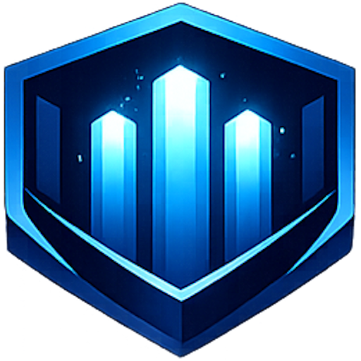

<!-- _class: lead -->

<!--
(30 sec a 1 min)

Bonjour, je suis Damien Guesdon.

J'ai suivi la formation AI Engineer d'OpenClassrooms. Pas pour changer de métier — j'etais directeur technique. Pour ajouter l'IA a ma boite a outils. Pour comprendre assez bien ce que mes equipes font, et pouvoir les challenger, les guider, federer autour d'un objectif commun sans me faire enfumer.

Cette presentation, c'est la visite guidee de mes trois livrables P15 : mon projet technique SophIA, ma carte mentale, et mon portfolio en ligne.

On commence par le contexte qui a donne naissance a tout ca.
-->

# **SophIA**
## Portfolio AI Engineer

  <strong>Damien GUESDON</strong> 
  AI Engineer 
  OpenClassrooms · Juin 2026 
  1608 heures · 15 projets

---

<!--
(1 min 30)

Avant de parler des livrables, plantons le decor.

Aujourd'hui, les entreprises decouvrent l'IA via ChatGPT, Copilot, et autres outils SaaS. Le probleme ? Vos brevets, vos donnees financieres, vos secrets industriels partent sur des serveurs a l'etranger, souvent sans que personne ne s'en rende compte. C'est ce qu'on appelle la Shadow AI.

J'ai vecu ca en tant que directeur technique : j'ai vu des equipes deployer des solutions IA sans aucune gouvernance. Pas par mauvaise volonte, mais parce qu'il n'y avait pas d'alternative interne.

SophIA est nee de ce constat. Ce n'est pas juste un projet technique de plus — c'est la reponse a un besoin metier concret : comment faire de l'IA en maitrisant sa souverainete ?

Le choix de partir sur OKD SNO bare-metal, c'est ce qui permet l'air-gap : aucune donnee ne quitte le cluster. Est-ce que c'est plus complexe qu'une solution cloud ? Oui. Est-ce que c'est le bon choix quand la souverainete est l'exigence numero un ? Absolument. Le cloud aurait ete plus simple a deployer, mais il n'aurait pas repondu au besoin de cloisonnement.

Ca m'a aussi conforte dans mon approche : en tant que manager, je ne veux pas subir les choix techniques de mes equipes — je veux les comprendre et les valider.
-->

# 1. Contexte & Problématique

#### **Le constat :** Shadow AI et besoin de <strong>souveraineté technologique</strong>

  

    <h3>Le phénomène Shadow AI</h3>
    <ul>
      <li>Adoption massive de l'IA générative via SaaS (ChatGPT, Copilot)</li>
      <li>PI injectée sur des serveurs étrangers sans contrôle</li>
      <li>Aucune gouvernance des données sensibles</li>
    </ul>
  

  

    <h3>La réponse SophIA</h3>
    <ul>
      <li>Plateforme multi-agents souveraine sur OKD SNO bare-metal</li>
      <li>GPU NVIDIA Tesla A2 (16 Go) — air-gap total</li>
      <li>Aucune donnée ne quitte l'infrastructure</li>
    </ul>
  

<blockquote>
"Ce qui distingue un architecte de plateforme d'un data scientist, c'est la capacité à orchestrer toute la chaîne, de la collecte du besoin au monitoring en production."
</blockquote>

---

<!--
(2 min)

Entrons dans le premier livrable : mon projet technique personnel SophIA.

Pour le comprendre, il faut voir d'ou je viens. J'ai 20 ans d'experience en infrastructure critique — reseau MPLS, Cisco, BGP, direction technique. Mais l'IA, c'etait nouveau pour moi.

J'ai donc suivi les 15 projets de la formation, soit 1608 heures au total. 804 heures supervisees, 804 heures guidees. Chaque projet m'a apporte une brique. Et chaque brique, je l'ai construite moi-meme.

Pourquoi c'est important ? Parce qu'en tant que directeur technique, j'aurais pu me contenter de manager des equipes qui font. Mais non — j'ai voulu mettre les mains dans le cambouis. Pas pour devenir ingenieur, mais pour comprendre ce que mes equipes vivent au quotidien. Pour savoir reconnaitre une architecture bancale, challenger un choix technique, et gagner la confiance de mes equipes parce que je parle le meme langage qu'elles.

Regardez le tableau : le RAG, je l'ai experimente en P7. Le deploiement sur OKD en P12. L'orchestration d'agents en P13. L'inference LLM locale en P14. Chaque brique de SophIA a ete testee, validee, comprise dans un projet precedent. SophIA, c'est la synthese de tout ca.

Ce que ce portfolio montre, ce n'est pas seulement "j'ai fait 15 projets". C'est "voici comment ces 15 projets construisent une vision coherente". Et c'est exactement ce qu'on attend d'un Head of AI Platform.
-->

# 2. Livrable 1 : SophIA

#### **Projet technique personnel — <strong>1608 heures, 15 projets fondateurs</strong>

  

    <h3>Briques clés de SophIA</h3>
    <table>
      <tr><th>Brique</th><th>Projet source</th></tr>
      <tr><td>RAG / Qdrant</td><td>P7 — Système RAG</td></tr>
      <tr><td>Déploiement OKD</td><td>P12 — CheckIt.AI</td></tr>
      <tr><td>Orchestration agents</td><td>P13 — Chess Master</td></tr>
      <tr><td>Inférence LLM locale</td><td>P14 — CHSA PosoLogic</td></tr>
      <tr><td>Monitoring / drift</td><td>P8 — MLOps avancé</td></tr>
    </table>
  

  

    <h3>Notions acquises</h3>
    <ul>
      <li><strong>P1-P3</strong> : Python, Git, API IA, ML supervisé</li>
      <li><strong>P4-P6</strong> : XGBoost, FastAPI, MLflow, SHAP</li>
      <li><strong>P7-P8</strong> : LangChain, Docker, Evidently, Ragas</li>
      <li><strong>P9-P11</strong> : Azure, Deep Learning, RL</li>
      <li><strong>P12-P14</strong> : Airflow, LangGraph, LoRA, vLLM</li>
    </ul>
  

---

<!--
(2 min)

Entrons dans le coeur technique du premier livrable.

SophIA, c'est une plateforme multi-agents organisee en 9 namespaces OKD. 9 zones fonctionnelles isolees, dont certaines sont en air-gap — pas d'acces sortant. Pourquoi 9 ? Parce que chaque zone a un job precis.

La zone usine, c'est Forgejo et le CI/CD — la seule qui communique avec l'exterieur. La zone cerveau, c'est l'orchestration centrale Hermes et le routeur LiteLLM. Les zones inference et memoire sont en air-gap : le GPU et la base vectorielle Qdrant. Aucune donnee n'en sort. La zone DMZ est le point d'entree utilisateur. Et il y a des zones pour les outils, le frontend, le dev, les tests.

Ensuite, le Pantheon agentique : cinq agents specialises. Hermes orchestre tout. Dionysos supervise le cluster. Hephaistos cree des environnements de dev a la demande. Athena gere les droits d'acces. Ouranos valide les mises en production.

J'ai concu cette architecture comme un chef d'orchestre. Les agents sont independants — comme les equipes que je dirige. Chacun a son perimetre, ses responsabilites, son isolation. Si un agent tombe, les autres continuent. C'est une architecture industrielle, pas un POC.

La stack technique : OKD SNO, LiteLLM, Qdrant, Prometheus, Grafana, Forgejo. Chaque techno a ete choisie pour sa maturite et sa compatibilite avec l'air-gap.

J'ai fait ce projet en solo, mais je l'ai pense comme si c'etait une equipe. Parce que c'est comme ca que je travaille : je conçois l'architecture, je valide les choix, je definis les perimetres. Et demain, avec une equipe, je passerai la main sur l'execution tout en gardant la vision.
-->

# 3. Architecture SophIA

#### **Cluster OKD SNO bare-metal — <strong>GPU NVIDIA Tesla A2</strong>

  

    <h3>9 namespaces isolés</h3>
    <ul>
      <li><strong>sophia-git</strong> : Forgejo, CI/CD (seule zone avec accès sortant)</li>
      <li><strong>sophia-core</strong> : Hermes, LiteLLM, orchestration</li>
      <li><strong>sophia-inference</strong> : Inférence LLM (air-gap)</li>
      <li><strong>sophia-memory</strong> : Qdrant, pipeline RAG</li>
      <li><strong>sophia-dmz</strong> : Point d'entrée utilisateur</li>
      <li><strong>sophia-skills</strong> : Outils MCP, TTS</li>
      <li><strong>sophia-apps</strong> : Frontends</li>
      <li><strong>sophia-sandbox</strong> : Développement</li>
      <li><strong>sophia-test</strong> : Tests automatisés</li>
    </ul>
  

  

    <h3>Pantheon Agentique</h3>
    <table>
      <tr><th>Agent</th><th>Rôle</th></tr>
      <tr><td><strong>Hermes</strong></td><td>Orchestrateur central</td></tr>
      <tr><td><strong>Dionysos</strong></td><td>Supervision cluster</td></tr>
      <tr><td><strong>Hephaistos</strong></td><td>Développement</td></tr>
      <tr><td><strong>Athena</strong></td><td>RBAC / HITL</td></tr>
      <tr><td><strong>Ouranos</strong></td><td>Production HITL</td></tr>
    </table>
     
    
<strong>Stack :</strong> OKD · LiteLLM · Qdrant · Prometheus · Grafana

  

---

<!--
(1 min 30)

Deuxieme livrable : la carte mentale.

C'est l'exercice de reflexivite du P15. L'idee, c'est de prendre du recul sur ce que j'ai appris et de structurer mes competences.

J'ai organise la carte en deux grandes parties. Les hard skills : frameworks, MLOps, cloud, conteneurisation. Les soft skills : analyse, communication, gestion de projet, vulgarisation. Et au milieu, les axes d'amelioration — parce qu'un bon manager sait aussi reconnaitre ce qu'il ne maitrise pas encore.

Pourquoi cet exercice est important dans ma demarche ? Parce qu'il m'a force a mettre des mots sur ma progression. Au debut de la formation, je voyais l'IA comme une boite noire magique. Aujourd'hui, je sais comment fonctionne un transformer, je sais deployer un LLM localement, je sais orchestrer des agents. Je ne suis pas le meilleur data scientist du monde — ce n'est pas mon role. Mon role, c'est de savoir de quoi je parle quand mes equipes me proposent une solution.

Cette carte mentale, elle est accessible de deux facons : directement en Markdown dans le depot, et visuellement dans le Dashboard React dont je vais vous parler maintenant.

L'evolution du metier est claire : l'AI Engineer d'aujourd'hui ne peut plus se contenter d'entrainer des modeles. Il doit maitriser l'infrastructure, la securite, le cout, la gouvernance. C'est exactement ce que ce portfolio demontre. Et en tant que directeur technique, cette vision globale est mon pain quotidien.
-->

# 4. Livrable 2 : Carte Mentale

#### **Compétences et réflexivité — <strong>Hard skills, soft skills, axes d'amélioration</strong>

  

    
Hard Skills

    

      Python · PyTorch · TensorFlow 
      LangChain · LangGraph · Airflow 
      Docker · OKD · Kubernetes 
      FastAPI · MLflow · Evidently
    

  

  

    
Soft Skills

    

      Management d'équipe technique 
      Vulgarisation et communication 
      Autonomie et prise de décision 
      Gestion de projet agile
    

  

  

    
Axes d'amélioration

    

      Cloud natif (AWS, Azure) 
      MLOps avancé (Kubeflow, DVC) 
      Monitoring production 
      Documentation systématique
    

  

---

<!--
(1 min)

Troisieme livrable : le portfolio en ligne.

C'est un Dashboard React deploye sur GitHub Pages. Il presente l'ensemble des 15 projets avec leur progression visible, les competences associees, et les liens vers chaque livrable.

Il y a aussi le site vitrine de SophIA a sophia.kisai.fr, qui sert de point d'entree vers la plateforme agentique.

Ce que j'aime dans ce livrable, c'est qu'il rend concrets les deux premiers. SophIA, c'est technique. La carte mentale, c'est abstrait. Le Dashboard, c'est la vitrine qui montre tout ca de facon propre et professionnelle. C'est exactement l'outil dont j'aurais besoin en tant que manager pour presenter le travail de mon equipe a la direction.

Les trois livrables sont en ligne, accessibles, operationnels. Le code source est public sur GitHub. Tout est documente.
-->

# 5. Livrable 3 : Portfolio en Ligne

#### **Dashboard React GitHub Pages — <strong>3 livrables accessibles</strong>

  

    
Dashboard

    

      <a href="https://kisai-dg-slu.github.io">kisai-dg-slu.github.io</a>  
      15 projets avec progression 
      Compétences et liens 
      Synthèse visuelle
    

  

  

    
Site Vitrine SophIA

    

      <a href="https://sophia.kisai.fr">sophia.kisai.fr</a>  
      Plateforme agentique 
      Documentation live 
      Point d'entrée utilisateur
    

  

  

    
Code source

    

      <a href="https://github.com/Kisai-DG-SLU/portfolio">github.com/Kisai-DG-SLU</a>  
      Dépôts publics 
      Code ouvert 
      Contribution possible
    

  

---

<!--
(1 min 30)

Parlons maintenant de comment j'ai géré ce projet.

Parce que oui, j'avais un plan. Meme en solo, j'ai applique une methode de gestion de projet rigoureuse : backlog de tickets sur Forgejo, sprints organises par phase (MVP, V2, V3, V4), et des KPIs pour mesurer la qualite.

Les KPIs : disponibilite du cluster visee a 99.5%, temps de reponse inference sous les 5 secondes, utilisation GPU entre 60 et 80%, couverture de tests au-dela de 80%.

Le budget : 3700 euros d'investissement initial pour le GPU et le serveur. 50 euros par mois d'electricite. Compare a 300 euros par mois pour une solution cloud equivalente. Amorti en moins d'un an.

La roadmap est claire. Le MVP est operationnel : cluster OKD, LiteLLM, 5 agents. La V2 est en cours avec le RAG, le Dashboard et le site vitrine. La V3 apportera la supervision automatisee du cluster par Dionysos, et la V4 l'industrialisation complete avec les workflows n8n et les outils MCP.

J'ai gere ce projet comme je gere une equipe : avec des objectifs clairs, des echeances, et de la transparence sur l'avancement. Et c'est ce qui fait la difference entre un projet amateur et un projet professionnel. Le risque du solo, c'est le manque de regard critique. Je l'ai compense par des outils de monitoring, des tests systematiques, et une documentation rigoureuse.
-->

# 6. Gestion de Projet

#### **Méthodologie Kanban/Scrum hybride — <strong>Roadmap V1 à V4</strong>

  

    <h3>KPIs</h3>
    <table>
      <tr><th>KPI</th><th>Cible</th></tr>
      <tr><td>Disponibilité cluster</td><td>99.5%</td></tr>
      <tr><td>Temps réponse inférence</td><td>&lt;5s</td></tr>
      <tr><td>Utilisation GPU</td><td>60-80%</td></tr>
      <tr><td>Couverture tests</td><td>&gt;80%</td></tr>
    </table>
     
    <h3>Budget</h3>
    <ul>
      <li><strong>Investissement :</strong> ~3700 EUR (GPU + serveur)</li>
      <li><strong>Coût mensuel :</strong> ~50 EUR (électricité)</li>
      <li><strong>Économie vs cloud :</strong> ~300 EUR/mois</li>
    </ul>
  

  

    <h3>Roadmap</h3>
    <ul>
      <li><strong>MVP ✓</strong> : Cluster OKD, LiteLLM, 5 agents</li>
      <li><strong>V2 ← en cours</strong> : RAG, Dashboard, site vitrine</li>
      <li><strong>V3</strong> : Dionysos, Hephaistos, CI/CD</li>
      <li><strong>V4</strong> : n8n, MCP, Athena, Ouranos</li>
    </ul>
     
    <h3>Outils de suivi</h3>
    <ul>
      <li>Prometheus + Grafana pour le monitoring</li>
      <li>Backlog Forgejo pour les tickets</li>
      <li>Tests pytest automatisés</li>
    </ul>
  

---

<!--
(1 min 30)

Parlons bilan. J'aime etre honnete.

Les forces : souverainete totale, cout maitrise, securite grace a l'isolation reseau, et surtout l'agnosticisme LLM. Je peux changer de modele demain sans rien casser.

Les faiblesses : la complexite OKD. C'est un cout que j'assume mais qui demande une expertise pointue pour la maintenance. Le GPU est contraint a 16 Go. La documentation pourrait etre meilleure. Et j'aurais du integrer les tests plus tot dans le cycle de developpement.

Si je devais refaire quelque chose ? Je ferais un schema C4 unifie des le depart. J'ecrirais la documentation API en parallele du code. J'ecrirais les tests avant de coder, pas apres.

Mais c'est ca, la reflexivite. C'est reconnaitre que mes choix ont des consequences et les assumer. La complexite OKD n'est pas un defaut de conception — c'est le prix de la souverainete. Et en tant que directeur technique, c'est exactement le genre de compromis que je dois savoir evaluer et communiquer a ma direction.

Ce que cette formation m'a apporte, au-dela des competences techniques, c'est cette capacite a evaluer des solutions avec un regard critique. A ne pas me laisser bluffer par des promesses techniques. A savoir dire "cette solution est elegante mais voila ce qu'elle coute en maintenance".
-->

# 7. Bilan & Réflexivité

#### **Forces et axes d'amélioration — <strong>Regard critique</strong>

  
Forces

  
Axes d'amélioration

  

    
<strong>Souveraineté totale</strong> : aucune donnée ne quitte le cluster

    
<strong>Agnosticisme LLM</strong> : Mistral, Llama, Qwen interchangeables

    
<strong>Sécurité</strong> : isolation réseau par EgressFirewall

    
<strong>Coût maîtrisé</strong> : pas de dépendance cloud

  

  

    
<strong>Complexité</strong> : maintenance d'un cluster bare-metal

    
<strong>GPU contraint</strong> : 16 Go non fractionnables

    
<strong>Documentation</strong> : schéma C4 à unifier

    
<strong>Tests</strong> : à intégrer plus tôt dans le cycle

  

<blockquote>
"La réflexivité, c'est reconnaître que la complexité OKD est un coût et l'assumer comme un choix de souveraineté."
</blockquote>

---

<!--
(1 min 30)

Je termine avec la feuille de route.

SophIA ne s'arrete pas la. La V3 arrive avec Dionysos pour superviser le cluster automatiquement, Hephaistos pour creer des pods de dev a la demande, et un CI/CD industrialise. La V4 ira plus loin avec des workflows n8n, les outils MCP pour l'integration IDE, et les agents Athena et Ouranos pour la gouvernance.

Et mon objectif professionnel dans tout ca ? Head of AI Platform. Pas pour etre celui qui code, mais celui qui conçoit, architecte, challenge et federe.

Le metier d'AI Engineer evolue vers plus de DevOps et de SecOps. Dans trois ans, un AI Engineer devra savoir deployer, securiser et monitorer sa plateforme. C'est exactement la ou je positionne SophIA — et c'est exactement la ou je veux emmener mes futures equipes.

J'ajoute l'IA a ma boite a outils de directeur technique. Pas pour remplacer mes equipes — pour les comprendre, les guider, et federer autour d'une vision commune. C'est ca, la valeur ajoutee d'un DT qui a fait le travail de comprendre la technique : la confiance qu'il inspire a ses equipes, et la credibilite qu'il a aupres de sa direction.
-->

# 8. Perspectives

#### **Roadmap V3-V4 — <strong>Objectif : Head of AI Platform</strong>

  

    
V3 · Supervision

    

      Dionysos : supervision automatisée du cluster  
      Hephaistos : pods de dev à la demande  
      CI/CD BuildConfig industrialisé
    

  

  

    
V4 · Industrialisation

    

      n8n workflows métier  
      Outils MCP pour intégration IDE  
      Athena RBAC et Ouranos HITL
    

  

  

    
Head of AI Platform

    

      Concevoir et industrialiser des plateformes IA souveraines  
      Encadrer, challenger, guider les équipes d'ingénierie  
      Fédérer autour d'une vision
    

  

---

  

  <h3 style="text-transform:none; color:var(--color-primary); margin:0;">
    Trois livrables P15 opérationnels : SophIA, carte mentale, portfolio en ligne.
  </h3>

  
  
SophIA · Sovereign AI Platform

<!--
(30 sec)

Voila pour cette presentation. J'ai couvert mes trois livrables P15 : le projet technique SophIA, la carte mentale de reflexivite, et le portfolio en ligne.

Je suis disponible pour vos questions, que ce soit sur les choix techniques, la demarche de gestion de projet, ou mes perspectives professionnelles. Merci de votre attention.

(Note pour les questions : les six axes challenges sont couverts dans la presentation. Charlotte peut revenir sur n'importe quel point — objectif pro, choix OKD vs cloud, apport du portfolio, evolution du metier, gestion de projet solo, axes d'amelioration. Chaque reponse est deja dans le script des slides correspondants.)
-->
