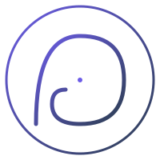

<!--
Note: Slide d'ouverture. Parler 1 min. Capter l'attention.
Présenter SophIA comme l'aboutissement de 15 projets et 1608h de formation.
Annoncer le plan : contexte, portfolio, architecture, gestion de projet, bilan.

CHALLENGE: Objectif pro. Si Charlotte demande "où vous voyez-vous dans 3 ans ?",
répondre Head of AI Platform avec les mots : "encadrer, challenger et guider
les équipes d'ingénierie".
-->

<!-- _class: lead -->

# **SophIA**
## Portfolio AI Engineer

  <strong>Damien GUESDON</strong> 
  AI Engineer 
  OpenClassrooms · Juin 2026 
  1608 heures · 15 projets

---

<!--
Note: 1 min 30. Contextualiser le marché de l'IA.
"Les entreprises découvrent ChatGPT et injectent leurs brevets sur des serveurs
étrangers sans gouvernance. C'est le phénomène Shadow AI."
La problématique n'est pas de "faire de l'IA" mais de le faire en maîtrisant
sa souveraineté.

CHALLENGE: Choix OKD vs cloud. Justifier : OKD SNO bare-metal = souveraineté,
coût maîtrisé, isolation réseau. Le cloud aurait été plus simple mais
n'aurait pas répondu au besoin de cloisonnement.
-->

# 1. Contexte & Problématique

#### **Le constat :** Shadow AI et besoin de <strong>souveraineté technologique</strong>

  

    <h3>Le phénomène Shadow AI</h3>
    <ul>
      <li>Adoption massive de l'IA générative via SaaS (ChatGPT, Copilot)</li>
      <li>PI injectée sur des serveurs étrangers sans contrôle</li>
      <li>Aucune gouvernance des données sensibles</li>
    </ul>
  

  

    <h3>La réponse SophIA</h3>
    <ul>
      <li>Plateforme multi-agents souveraine sur OKD SNO bare-metal</li>
      <li>GPU NVIDIA Tesla A2 (16 Go) — air-gap total</li>
      <li>Aucune donnée ne quitte l'infrastructure</li>
    </ul>
  

<blockquote>
"Ce qui distingue un architecte de plateforme d'un data scientist, c'est la capacité à orchestrer toute la chaîne, de la collecte du besoin au monitoring en production."
</blockquote>

---

<!--
Note: 2 min. Parcourir la progression. Montrer la montée en compétence.
"De P1 à P15, chaque projet a apporté une brique qui trouve sa place
dans l'architecture finale de SophIA."

CHALLENGE: Apport du portfolio. Le portfolio ne montre pas seulement les compétences,
il démontre la capacité à les intégrer dans un ensemble cohérent.
-->

# 2. Les 15 Projets Fondateurs

#### **1608 heures de formation — <strong>804 h supervisées + 804 h guidées</strong>

  

    <h3>Briques clés de SophIA</h3>
    <table>
      <tr><th>Brique</th><th>Projet source</th></tr>
      <tr><td>RAG / Qdrant</td><td>P7 — Système RAG</td></tr>
      <tr><td>Déploiement OKD</td><td>P12 — CheckIt.AI</td></tr>
      <tr><td>Orchestration agents</td><td>P13 — Chess Master</td></tr>
      <tr><td>Inférence LLM locale</td><td>P14 — CHSA PosoLogic</td></tr>
      <tr><td>Monitoring / drift</td><td>P8 — MLOps avancé</td></tr>
    </table>
  

  

    <h3>Notions acquises</h3>
    <ul>
      <li><strong>P1-P3</strong> : Python, Git, API IA, ML supervisé</li>
      <li><strong>P4-P6</strong> : XGBoost, FastAPI, MLflow, SHAP</li>
      <li><strong>P7-P8</strong> : LangChain, Docker, Evidently, Ragas</li>
      <li><strong>P9-P11</strong> : Azure, Deep Learning, RL</li>
      <li><strong>P12-P14</strong> : Airflow, LangGraph, LoRA, vLLM</li>
    </ul>
  

---

<!--
Note: 2 min. Montrer le portfolio. Parler du Dashboard React, de la carte mentale,
de la façon dont les compétences sont organisées.

CHALLENGE: Évolution du métier. "L'AI Engineer d'aujourd'hui doit maîtriser
l'infrastructure, la sécurité, le coût et la gouvernance."
-->

# 3. Portfolio & Compétences

#### **Trois livrables opérationnels — <strong>Objectif : Head of AI Platform</strong>

  

    
Dashboard React

    
Portfolio en ligne déployé sur GitHub Pages  
      <a href="https://kisai-dg-slu.github.io">kisai-dg-slu.github.io</a>  
      15 projets avec progression visible
    

  

  

    
Carte Mentale

    
Compétences hard skills et soft skills  
      Liens entre projets et architecture SophIA  
      Axes d'amélioration identifiés
    

  

  

    
Site Vitrine

    
Plateforme SophIA en ligne  
      <a href="https://sophia.kisai.fr">sophia.kisai.fr</a>  
      Point d'entrée de la plateforme agentique
    

  

<blockquote>
"L'objectif professionnel : encadrer, challenger et guider les équipes d'ingénierie en tant que Head of AI Platform."
</blockquote>

---

<!--
Note: 2 min. C'est le cœur technique. Expliquer l'architecture OKD,
les 9 namespaces, les 5 agents du Pantheon.

CHALLENGE: Gestion de projet solo. "L'architecture a été pensée comme si
c'était une équipe : chaque agent est indépendant, chaque namespace isolé.
C'est une architecture industrielle, pas un POC."
-->

# 4. Architecture SophIA

#### **Cluster OKD SNO bare-metal — <strong>GPU NVIDIA Tesla A2</strong>

  

    <h3>9 namespaces isolés</h3>
    <ul>
      <li><strong>sophia-git</strong> : Forgejo, CI/CD (seule zone avec accès sortant)</li>
      <li><strong>sophia-core</strong> : Hermes, LiteLLM, orchestration</li>
      <li><strong>sophia-inference</strong> : Inférence LLM (air-gap)</li>
      <li><strong>sophia-memory</strong> : Qdrant, pipeline RAG</li>
      <li><strong>sophia-dmz</strong> : Point d'entrée utilisateur</li>
      <li><strong>sophia-skills</strong> : Outils MCP, TTS</li>
      <li><strong>sophia-apps</strong> : Frontends</li>
      <li><strong>sophia-sandbox</strong> : Développement</li>
      <li><strong>sophia-test</strong> : Tests automatisés</li>
    </ul>
  

  

    <h3>Pantheon Agentique</h3>
    <table>
      <tr><th>Agent</th><th>Rôle</th></tr>
      <tr><td><strong>Hermes</strong></td><td>Orchestrateur central</td></tr>
      <tr><td><strong>Dionysos</strong></td><td>Supervision cluster</td></tr>
      <tr><td><strong>Hephaistos</strong></td><td>Développement</td></tr>
      <tr><td><strong>Athena</strong></td><td>RBAC / HITL</td></tr>
      <tr><td><strong>Ouranos</strong></td><td>Production HITL</td></tr>
    </table>
     
    
<strong>Stack :</strong> OKD · LiteLLM · Qdrant · Prometheus · Grafana

  

---

<!--
Note: 1 min 30. Expliquer la démarche de gestion de projet.
Montrer la rigueur : backlog, sprints, KPIs, budget.

CHALLENGE: Gestion de projet solo (bis). "Le risque du solo, c'est le manque
de regard critique. Je l'ai compensé par des outils de monitoring,
des tests systématiques et une documentation rigoureuse."
-->

# 5. Gestion de Projet

#### **Méthodologie Kanban/Scrum hybride — <strong>Roadmap V1 à V4</strong>

  

    <h3>KPIs</h3>
    <table>
      <tr><th>KPI</th><th>Cible</th></tr>
      <tr><td>Disponibilité cluster</td><td>99.5%</td></tr>
      <tr><td>Temps réponse inférence</td><td>&lt;5s</td></tr>
      <tr><td>Utilisation GPU</td><td>60-80%</td></tr>
      <tr><td>Couverture tests</td><td>&gt;80%</td></tr>
    </table>
     
    <h3>Budget</h3>
    <ul>
      <li><strong>Investissement :</strong> ~3700 EUR (GPU + serveur)</li>
      <li><strong>Coût mensuel :</strong> ~50 EUR (électricité)</li>
      <li><strong>Économie vs cloud :</strong> ~300 EUR/mois</li>
    </ul>
  

  

    <h3>Roadmap</h3>
    <ul>
      <li><strong>MVP ✓</strong> : Cluster OKD, LiteLLM, 5 agents</li>
      <li><strong>V2 ← en cours</strong> : RAG, Dashboard, site vitrine</li>
      <li><strong>V3</strong> : Dionysos, Hephaistos, CI/CD</li>
      <li><strong>V4</strong> : n8n, MCP, Athena, Ouranos</li>
    </ul>
     
    <h3>Outils de suivi</h3>
    <ul>
      <li>Prometheus + Grafana pour le monitoring</li>
      <li>Backlog Forgejo pour les tickets</li>
      <li>Tests pytest automatisés</li>
    </ul>
  

---

<!--
Note: 1 min 30. Bilan critique. Montrer qu'on a du recul.
"Forces : souveraineté, coût, sécurité. Faiblesses : complexité, GPU contraint."

CHALLENGE: Axes d'amélioration. Charlotte va demander "que feriez-vous mieux?"
Répondre : (1) schéma C4 unifié dès l'origine, (2) tests plus tôt dans le cycle,
(3) documentation API systématique.
-->

# 6. Résultats & Bilan Critique

#### **Forces et axes d'amélioration — <strong>Réflexivité</strong>

  
Forces

  
Axes d'amélioration

  

    
<strong>Souveraineté totale</strong> : aucune donnée ne quitte le cluster

    
<strong>Agnosticisme LLM</strong> : Mistral, Llama, Qwen interchangeables

    
<strong>Sécurité</strong> : isolation réseau par EgressFirewall

    
<strong>Coût maîtrisé</strong> : pas de dépendance cloud

  

  

    
<strong>Complexité</strong> : maintenance d'un cluster bare-metal

    
<strong>GPU contraint</strong> : 16 Go non fractionnables

    
<strong>Documentation</strong> : schéma C4 à unifier

    
<strong>Tests</strong> : à intégrer plus tôt dans le cycle

  

<blockquote>
"La réflexivité, c'est reconnaître que la complexité OKD est un coût et l'assumer comme un choix de souveraineté."
</blockquote>

---

<!--
Note: 1 min 30. Vision et perspectives. Montrer la roadmap.
"SophIA ne s'arrête pas à la V2. V3 apporte la supervision automatisée
du cluster, V4 l'industrialisation complète."

CHALLENGE: Évolution du métier (approfondir). "Le métier d'AI Engineer évolue
vers plus de DevOps et de SecOps. Dans 3 ans, un AI Engineer devra savoir
déployer, sécuriser et monitorer sa plateforme."
-->

# 7. Roadmap & Perspectives

#### **Prochaines étapes — <strong>Objectif : Head of AI Platform</strong>

  

    
V3 · Supervision

    

      Dionysos : supervision automatisée du cluster  
      Hephaistos : création de pods de dev à la demande  
      CI/CD BuildConfig industrialisé
    

  

  

    
V4 · Industrialisation

    

      n8n pour les workflows métier  
      Outils MCP pour intégration IDE  
      Athena RBAC et Ouranos HITL
    

  

  

    
Objectif Pro

    

      <strong>Head of AI Platform</strong>  
      Encadrer, challenger et guider les équipes d'ingénierie  
      Concevoir et industrialiser des plateformes IA souveraines
    

  

---

  

  <h3 style="text-transform:none; color:var(--color-primary); margin:0;">
    Portfolio validé : 15 projets, 1608 heures de formation, une plateforme agentique souveraine déployée sur OKD bare-metal.
  </h3>

  
  
SophIA · Sovereign AI Platform

<!--
Note: 30 sec. Conclusion rapide. Remercier. Ouvrir les questions.

CHALLENGE: Les 6 axes sont couverts dans les slides précédentes.
Charlotte peut revenir sur n'importe lequel.
-->
